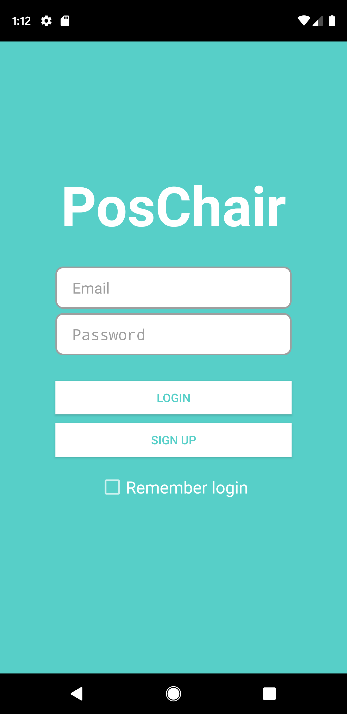
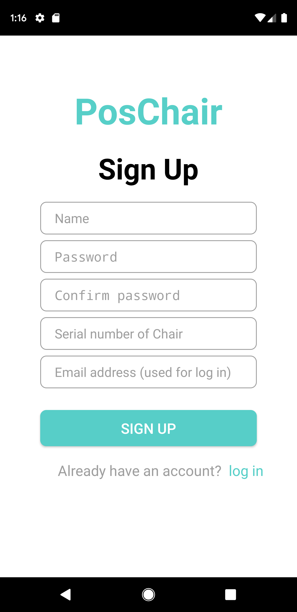
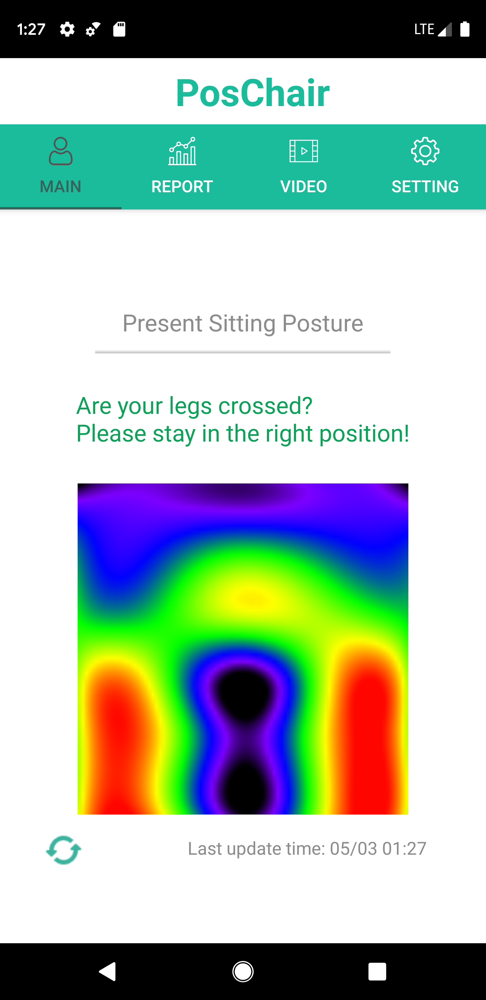
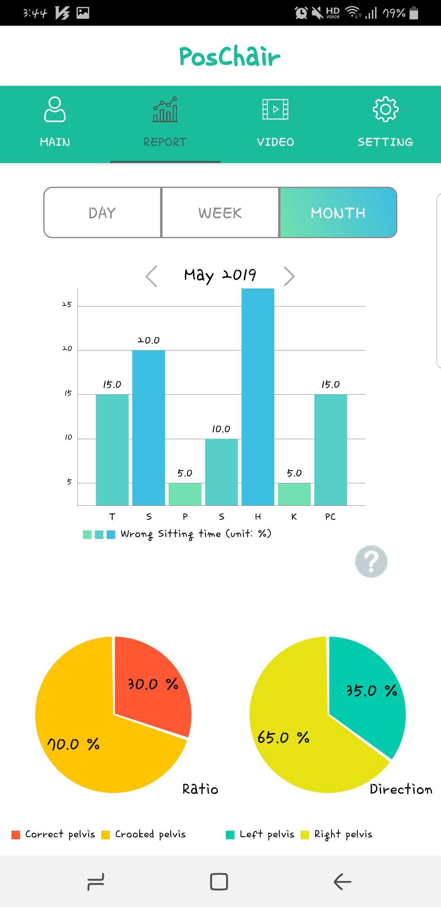
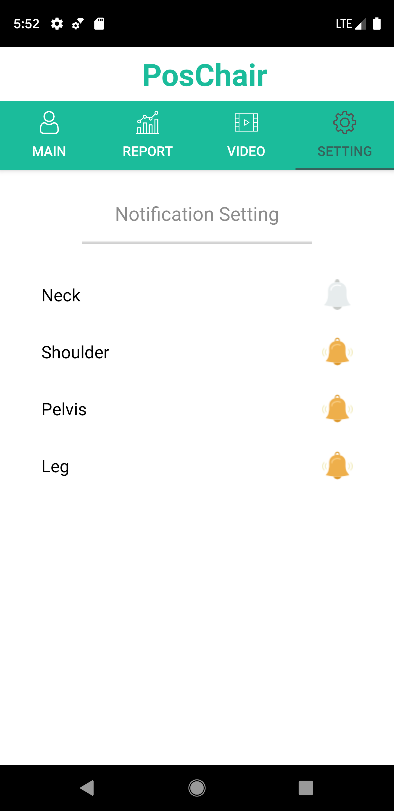

# PosChair

> Sitting Posture Correction System using Arduino-based Chair and Deep Learning Model

#### Application module for PosChairsitting posture correction system

## Android UI

1. User Layout
	- Login 	
	
		

	- Sign up
		
		

2. Function Layout
	- Main tab
	
		
	- Chart tab
	
		
	- Video tab
		
		
	- Notification tab

		
